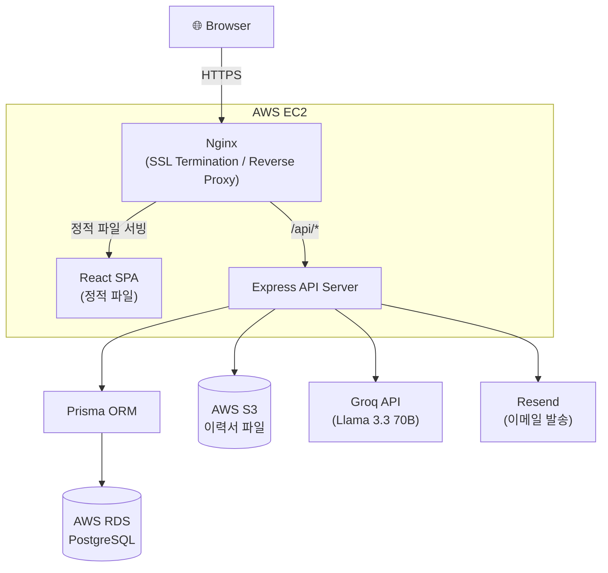
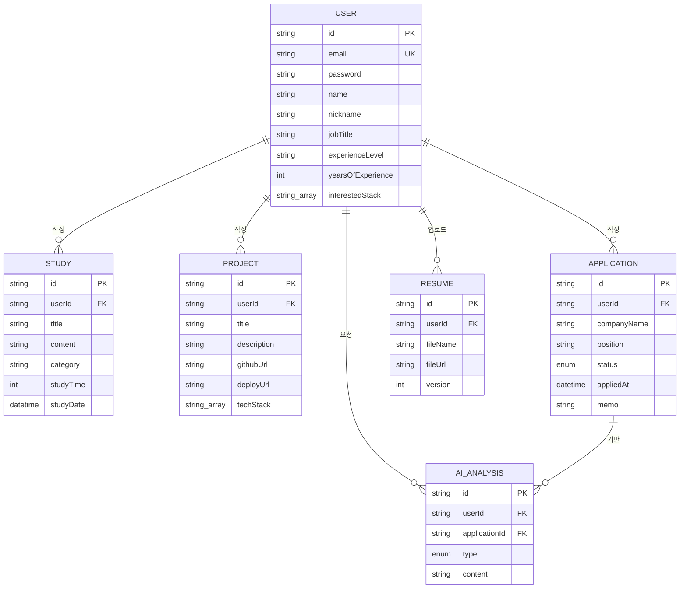
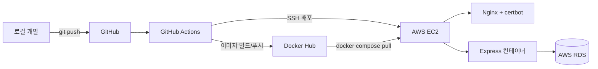
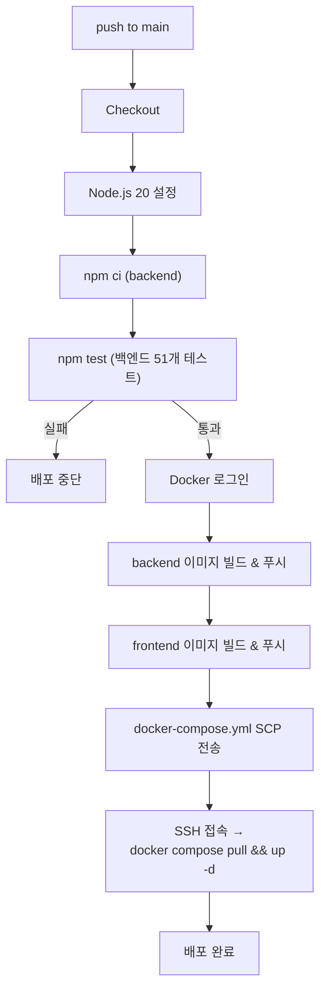

# CareerHub

> AI를 활용한 개발자 취업 준비 및 커리어 관리 플랫폼

🔗 **Live Demo**: https://aicareerhub-site.duckdns.org
📘 **API 문서 (Swagger)**: https://aicareerhub-site.duckdns.org/api-docs

---

## 목차

1. [프로젝트 소개](#프로젝트-소개)
2. [주요 기능](#주요-기능)
3. [서비스 화면](#서비스-화면)
4. [기술 스택](#기술-스택)
5. [시스템 아키텍처](#시스템-아키텍처)
6. [프로젝트 구조](#프로젝트-구조)
7. [ERD](#erd)
8. [API 문서](#api-문서)
9. [실행 방법](#실행-방법)
10. [환경 변수](#환경-변수)
11. [폴더 구조 설명](#폴더-구조-설명)
12. [핵심 기술 설명](#핵심-기술-설명)
13. [트러블슈팅](#트러블슈팅)
14. [성능 / 최적화](#성능--최적화)
15. [보안](#보안)
16. [테스트](#테스트)
17. [배포](#배포)
18. [CI/CD](#cicd)
19. [회고](#회고)
20. [향후 계획](#향후-계획)
21. [팀 정보](#팀-정보)
22. [라이선스](#라이선스)
23. [Contact](#contact)

---

## 프로젝트 소개

개발자 취업 준비 과정은 보통 여러 곳에 흩어져서 관리됩니다.
학습 기록은 노션에, 프로젝트 목록은 이력서 파일에, 지원 현황은 스프레드시트에 — 이렇게 나뉘어 있으면
"지금까지 내가 뭘 준비해왔는지"를 한눈에 파악하기 어렵고, 그 데이터를 자기소개서나 면접 준비에 다시 활용하기도 번거롭습니다.

**CareerHub**는 학습 기록·프로젝트·지원 현황·이력서를 한 곳에 모으고,
그렇게 쌓인 데이터를 AI가 실제로 활용해서 자기소개서 초안과 예상 면접 질문을 생성해주는 것을 목표로 만든 서비스입니다.

- 어떤 서비스인가: 취업 준비 활동을 기록하고, 그 기록을 기반으로 AI 분석을 받는 개인 커리어 관리 플랫폼
- 왜 만들었는가: 여러 도구에 흩어진 취업 준비 기록을 한 곳으로 모으고 싶어서
- 해결하려는 문제: 파편화된 취업 준비 기록 → 재사용 불가능한 데이터
- 핵심 가치: 기록 → 통계 → AI 분석으로 이어지는 하나의 흐름

프로젝트를 만들며 내린 설계 결정과 그 이유는 [why.md](./why.md)에 별도로 정리했습니다.

---

## 주요 기능

### 인증

- 회원가입 / 로그인 (이메일 + 비밀번호)
- JWT 기반 인증 (Access Token + Refresh Token, httpOnly 쿠키)
- 비밀번호 찾기 / 재설정 (Resend를 통한 이메일 인증, 1회용 만료 토큰)

### 학습 기록 / 프로젝트 / 지원 현황 관리

- 학습 기록 CRUD (제목, 내용, 카테고리, 학습 시간, 학습 날짜)
- 프로젝트 CRUD (제목, 설명, 기술 스택, GitHub/배포 링크)
- 지원 현황 CRUD (회사명, 포지션, 진행 상태 5단계, 메모)

### 이력서 관리

- 이력서 업로드 (PDF / DOC / DOCX, 최대 10MB, AWS S3 저장)
- 버전 자동 관리 (업로드할 때마다 버전 증가)

### AI 커리어 분석

- 지원 내역을 선택하면 해당 회사/포지션 기준으로 자기소개서 초안 생성
- 예상 면접 질문 생성
- 생성 결과는 지원 건마다 누적 저장 (기존 결과를 덮어쓰지 않음)

### 대시보드

- 학습 기록 / 프로젝트 / 지원 현황 통계 카드
- 지원 상태별 분포 차트 (Recharts)

---

## 서비스 화면

> TODO: 아래 각 항목에 실제 스크린샷 추가 (`docs/images/` 에 저장 후 경로 연결)

| 화면      | 스크린샷 |
| --------- | -------- |
| 랜딩 페이지 | TODO |
| 회원가입 / 로그인 | TODO |
| 대시보드 | TODO |
| 학습 기록 | TODO |
| 프로젝트 | TODO |
| 지원 현황 | TODO |
| AI 도우미 | TODO |
| 이력서 관리 | TODO |
| 모바일 (375px) | TODO |

---

## 기술 스택

### Frontend

| 분류 | 기술 |
| --- | --- |
| 언어 / 프레임워크 | React, TypeScript |
| 라우팅 | React Router (Data Router) |
| 서버 상태 관리 | TanStack Query (React Query) |
| 폼 / 검증 | React Hook Form, Zod |
| 스타일링 | CSS Modules |
| 차트 | Recharts |
| 빌드 도구 | Vite |

### Backend

| 분류 | 기술 |
| --- | --- |
| 언어 / 프레임워크 | Node.js, Express 5, TypeScript |
| 인증 | JWT (Access / Refresh Token), bcrypt |
| 검증 | Zod |
| 파일 업로드 | Multer, AWS S3 |
| 이메일 | Resend |
| AI | Groq (Llama 3.3 70B) |
| API 문서 | Swagger (swagger-jsdoc / swagger-ui-express) |

### Database

| 분류 | 기술 |
| --- | --- |
| DBMS | PostgreSQL (AWS RDS) |
| ORM | Prisma |

### DevOps / Infra

| 분류 | 기술 |
| --- | --- |
| 컨테이너 | Docker (멀티 스테이지 빌드) |
| CI/CD | GitHub Actions |
| 배포 | AWS EC2 |
| 스토리지 | AWS S3 |
| 리버스 프록시 | Nginx |
| HTTPS | Let's Encrypt (certbot) |
| 도메인 | DuckDNS |

### Tools

| 분류 | 기술 |
| --- | --- |
| 테스트 | Vitest |
| 코드 품질 | ESLint, TypeScript strict mode |

---

## 시스템 아키텍처



인증서(Let's Encrypt)는 certbot 컨테이너가 발급/갱신하고, Nginx가 `443` 포트에서 SSL을 종료한 뒤
정적 파일은 직접 서빙, `/api/*` 요청만 내부 네트워크로 Express 컨테이너에 프록시합니다.

---

## 프로젝트 구조

```text
AI_careerHub/
├── frontend/               # React SPA
│   ├── src/
│   │   ├── api/            # axios 기반 API 클라이언트
│   │   ├── components/     # 페이지별 / 공용 컴포넌트
│   │   ├── hooks/          # React Query 커스텀 훅
│   │   ├── pages/          # 라우트 단위 페이지
│   │   ├── routes/         # React Router 설정
│   │   └── types/          # 공용 타입 정의
│   ├── nginx.conf
│   └── Dockerfile
│
├── backend/                 # Express API 서버
│   ├── src/
│   │   ├── config/          # S3, Swagger 등 외부 설정
│   │   ├── controllers/     # 요청/응답 처리
│   │   ├── services/        # 비즈니스 로직
│   │   ├── routes/          # 라우트 정의 (Swagger 주석 포함)
│   │   ├── validations/     # Zod 스키마
│   │   ├── middlewares/     # 인증, 검증, 에러 핸들링
│   │   ├── errors/          # 커스텀 에러 클래스
│   │   ├── prisma/          # Prisma schema / client
│   │   └── tests/           # Vitest 유닛 테스트
│   └── Dockerfile
│
├── docs/                     # ERD, API, 아키텍처 문서
├── docker-compose.yml        # 배포용 컨테이너 구성
├── why.md                    # 설계 결정과 그 이유
└── .github/workflows/        # GitHub Actions CI/CD
```

---

## ERD



전체 컬럼 설명은 [docs/ERD.md](./docs/ERD.md) 참고.

---

## API 문서

전체 API는 배포 환경에서 Swagger UI로 확인할 수 있습니다: **[/api-docs](https://aicareerhub-site.duckdns.org/api-docs)**

대표 엔드포인트:

| Method | URL | 설명 | 인증 |
| --- | --- | --- | --- |
| POST | `/auth/register` | 회원가입 | ✗ |
| POST | `/auth/login` | 로그인 (JWT 쿠키 발급) | ✗ |
| POST | `/auth/refresh` | Access Token 재발급 | ✗ (Refresh Token) |
| POST | `/auth/forgot-password` | 비밀번호 재설정 이메일 발송 | ✗ |
| POST | `/auth/reset-password` | 토큰으로 비밀번호 재설정 | ✗ |
| GET | `/auth/me` | 내 정보 조회 | ✓ |
| GET / POST | `/studies` | 학습 기록 목록 조회 / 생성 | ✓ |
| PATCH / DELETE | `/studies/:id` | 학습 기록 수정 / 삭제 | ✓ |
| GET / POST | `/projects` | 프로젝트 목록 조회 / 생성 | ✓ |
| PATCH / DELETE | `/projects/:id` | 프로젝트 수정 / 삭제 | ✓ |
| GET / POST | `/applications` | 지원 현황 목록 조회 / 생성 | ✓ |
| PATCH / DELETE | `/applications/:id` | 지원 현황 수정 / 삭제 | ✓ |
| GET / POST | `/resumes` | 이력서 목록 조회 / 업로드 | ✓ |
| DELETE | `/resumes/:id` | 이력서 삭제 | ✓ |
| GET | `/dashboard` | 대시보드 통계 조회 | ✓ |
| POST | `/ai/cover-letter` | 자기소개서 초안 생성 | ✓ |
| POST | `/ai/interview-questions` | 예상 면접 질문 생성 | ✓ |
| GET | `/ai/analyses/:applicationId` | 지원 건별 AI 분석 이력 조회 | ✓ |
| GET | `/health` | 서버 / DB 상태 확인 (모니터링용) | ✗ |

---

## 실행 방법

### Clone

```bash
git clone https://github.com/gajigaji04/AI-Career-Tracker.git
cd AI-Career-Tracker
```

### Install

```bash
cd backend && npm install
cd ../frontend && npm install
```

### ENV

`backend/.env`, `frontend/.env` 파일을 아래 [환경 변수](#환경-변수) 표를 참고해서 각각 생성합니다.

### Run (개발 서버)

```bash
# 백엔드 (http://localhost:3000)
cd backend
npm run dev

# 프론트엔드 (http://localhost:5173)
cd frontend
npm run dev
```

### Build

```bash
# 백엔드
cd backend
npm run build      # tsc
npm start          # node dist/server.js

# 프론트엔드
cd frontend
npm run build       # tsc -b && vite build
npm run preview
```

### Docker

```bash
# 이미지 빌드
docker build -t careerhub-backend ./backend
docker build -t careerhub-frontend ./frontend

# 배포 환경과 동일하게 실행 (사전에 .env, docker-compose.yml 필요)
docker compose up -d
```

---

## 환경 변수

### Backend (`backend/.env`)

| 변수명 | 설명 |
| --- | --- |
| `DATABASE_URL` | PostgreSQL 연결 문자열 |
| `JWT_SECRET` | Access Token 서명 키 |
| `JWT_REFRESH_SECRET` | Refresh Token 서명 키 |
| `ALLOWED_ORIGIN` | CORS 허용 Origin (프론트엔드 URL) |
| `FRONTEND_URL` | 비밀번호 재설정 메일 내 링크에 사용되는 프론트엔드 주소 |
| `GROQ_API_KEY` | AI 분석(Groq) API 키 |
| `RESEND_API_KEY` | 이메일 발송(Resend) API 키 |
| `RESEND_FROM_EMAIL` | 이메일 발신 주소 |
| `AWS_REGION` | S3 리전 |
| `AWS_ACCESS_KEY_ID` | S3 접근 키 |
| `AWS_SECRET_ACCESS_KEY` | S3 시크릿 키 |
| `AWS_S3_BUCKET` | 이력서 업로드 버킷명 |
| `NODE_ENV` | `development` / `production` |

### Frontend (`frontend/.env`)

| 변수명 | 설명 |
| --- | --- |
| `VITE_API_URL` | 백엔드 API 베이스 URL (로컬: `http://localhost:3000`, 배포: `/api`) |

> ⚠️ 실제 값은 커밋하지 않습니다. 위 표는 키 이름과 용도만 안내합니다.

---

## 폴더 구조 설명

| 디렉토리 | 역할 |
| --- | --- |
| `controllers/` | HTTP 요청을 받아 `services/`를 호출하고 응답을 반환. 비즈니스 로직은 두지 않음 |
| `services/` | 실제 비즈니스 로직과 Prisma 쿼리. 테스트 대상의 대부분이 여기 있음 |
| `routes/` | 라우트 정의 + Swagger 주석(`@swagger`)으로 API 문서를 코드와 함께 관리 |
| `validations/` | Zod 스키마. `validate` 미들웨어에서 요청 body를 검증 |
| `middlewares/` | 인증(`authenticate`), 검증(`validate`), 전역 에러 핸들링(`errorHandler`) |
| `prisma/` | Prisma schema와 싱글턴 클라이언트 |
| `api/` (frontend) | axios 인스턴스와 엔드포인트별 요청 함수 |
| `hooks/` (frontend) | React Query 기반 데이터 패칭/뮤테이션 훅. 컴포넌트는 이 훅만 사용 |
| `components/common/` (frontend) | `Spinner`, `Select`, `PageState` 등 페이지 간 재사용 컴포넌트 |

라우트/서비스/검증을 계층별로 분리한 이유는 [핵심 기술 설명](#핵심-기술-설명) 참고.

---

## 핵심 기술 설명

### 인증 토큰을 localStorage가 아닌 httpOnly 쿠키로

localStorage에 JWT를 저장하면 XSS 공격으로 토큰이 그대로 탈취될 수 있습니다.
httpOnly 쿠키는 JavaScript에서 접근 자체가 불가능하므로, 이력서·자기소개서처럼 개인정보를 다루는 서비스라면
이 정도는 기본으로 가져가야 한다고 판단했습니다.

### AI 분석 결과는 덮어쓰지 않고 계속 누적

`AiAnalysis` 모델은 기존 결과를 `update`가 아니라 매번 `create`로 쌓습니다.
회사/포지션마다 강조할 포인트가 다르기 때문에 "하나의 범용 자기소개서"가 아니라
특정 지원 건에 종속된 결과물이어야 의미가 있고, 과거 생성 결과를 비교해봐야 다음 지원 때 더 나은 버전을 고를 수 있다고 봤습니다.

### 기술 스택은 배열로 저장하되, 입력은 콤마 구분 문자열로

DB에는 `String[]`로 저장해야 나중에 "기술 스택으로 필터링/집계" 같은 기능을 붙이기 쉽지만,
태그 입력 UI까지 만들 여유는 없어서 `React, TypeScript, Node.js`처럼 한 줄로 입력받고 서버에서 `split(",")`으로 변환하는 절충을 택했습니다.

### AI 엔진으로 Groq(Llama 3.3 70B) 선택

OpenAI 대비 무료/저비용으로 충분히 빠른 응답 속도를 낼 수 있어서, 포트폴리오 단계에서
API 비용 부담 없이 실제 LLM 연동 경험을 쌓기에 적합하다고 판단했습니다.

### 배포를 원클릭 PaaS가 아닌 EC2 + Docker + GitHub Actions로 직접 구성

Vercel/Render 같은 더 쉬운 선택지가 있었지만, "배포해봤다"라고 말하려면 이미지 빌드,
컨테이너 오케스트레이션, 리버스 프록시, 인증서 발급까지 직접 겪어봐야 한다고 생각했습니다.
실제로 이 과정에서 [트러블슈팅](#트러블슈팅)에 정리한 문제들을 겪고 고쳤습니다.

### React Query로 서버 상태 관리

컴포넌트가 로딩/에러/캐싱을 직접 다루지 않도록, 모든 API 호출을 `hooks/` 아래 커스텀 훅으로 감쌌습니다.
페이지는 `useStudies()`, `useApplication()` 같은 훅만 호출하고, 로딩/에러 상태는 공용 `PageState` 컴포넌트가 일관되게 처리합니다.

---

## 트러블슈팅

### 1. Docker 빌드 시 네이티브 모듈(bcrypt) 컴파일 실패

- **문제**: Windows에서 개발하다가 `docker build`를 돌리면 `bcrypt` 설치 단계에서 실패
- **원인**: Windows에서 생성된 `package-lock.json`에는 Alpine(musl) 환경용 optional dependency가 빠져 있어서, `npm ci`가 Alpine 컨테이너 안에서 필요한 네이티브 바이너리를 못 받아옴
- **해결**: `node:20-alpine` 컨테이너 안에서 `package-lock.json`을 다시 생성해서 플랫폼별 optional dependency를 포함시킴
- **배운 점**: lockfile은 "설치 결과"가 아니라 "플랫폼별 설치 계획"까지 담고 있어서, 로컬 OS와 배포 OS가 다르면 lockfile도 그 환경에서 생성해야 함

### 2. 배포 후 프로덕션 DB가 비어있음

- **문제**: 배포는 성공했는데 회원가입을 해도 실제 RDS에는 테이블 자체가 없음
- **원인**: 컨테이너 시작 스크립트에 `prisma migrate deploy`가 빠져 있어서, 로컬에서만 마이그레이션을 적용하고 프로덕션 DB에는 스키마가 반영되지 않음
- **해결**: `backend/Dockerfile`의 `CMD`를 `npx prisma migrate deploy && node dist/server.js`로 바꿔서, 컨테이너가 시작될 때마다 마이그레이션을 자동 적용
- **배운 점**: "마이그레이션 파일을 커밋했다" ≠ "프로덕션에 반영됐다". 배포 파이프라인 안에 마이그레이션 적용 단계를 명시적으로 넣어야 함

### 3. Resend 이메일이 프로덕션에서만 전송 안 됨

- **문제**: 로컬에서는 비밀번호 재설정 메일이 잘 가는데, 배포 환경에서 회원가입한 다른 이메일로는 메일이 안 옴
- **원인**: Resend 무료(샌드박스) 모드에서 `onboarding@resend.dev` 발신자는 **계정 소유자 본인 이메일로만** 전송 가능
- **해결**: 발신 제한을 인지한 뒤 테스트 시나리오를 계정 소유자 이메일 기준으로 조정하고, 커스텀 도메인 인증이 필요하다는 걸 문서화
- **배운 점**: 외부 서비스의 "무료 플랜"에는 눈에 안 보이는 제약이 있다는 걸 전제하고, 연동 초기에 공식 문서의 제약 조건부터 확인해야 함

### 4. 새로고침하면 404가 뜨는 SPA 라우팅 버그

- **문제**: `/app/dashboard`에서 새로고침하면 React Router가 아니라 서버가 먼저 404를 반환
- **원인**: Nginx가 존재하지 않는 경로 요청을 그대로 404 처리하고 있어서, React Router의 클라이언트 사이드 라우팅으로 넘어가지 못함
- **해결**: `nginx.conf`에 `try_files $uri $uri/ /index.html;`을 추가해서 알 수 없는 경로는 전부 `index.html`로 넘기고, 이후 라우팅은 React Router가 처리
- **배운 점**: SPA 배포는 프론트엔드 코드만 잘 짠다고 끝나는 게 아니라, 서버(Nginx) 설정이 라우팅 방식과 맞아야 함

### 5. 로그인 이후 화면이 모바일 폭(375px)에서 깨짐

- **문제**: 로그인 이후 화면(사이드바 포함 레이아웃)이 모바일 폭에서 본문이 짓눌려 글자가 세로로 쌓임
- **원인**: 사이드바가 `width: 240px` 고정값이었고, 전체 레이아웃에 모바일 브레이크포인트 자체가 없었음
- **해결**: 768px 이하에서 사이드바를 `position: fixed` 오버레이로 전환하고, 헤더에 햄버거 버튼을 추가해 열고 닫을 수 있게 함
- **배운 점**: 데스크톱에서만 개발/확인하면 반응형 버그는 눈에 안 보인다. 페이지 단위 반응형 검증뿐 아니라 레이아웃(앱 셸) 자체도 별도로 모바일 폭에서 확인해야 함

---

## 성능 / 최적화

- **TanStack Query 기반 캐싱** — 같은 데이터를 여러 페이지에서 다시 요청하지 않도록 서버 상태를 훅 단위로 캐싱
- **Docker 멀티 스테이지 빌드** — 프론트엔드는 빌드 산출물만 `nginx:alpine` 이미지에 복사해서 최종 이미지 크기를 최소화
- **공용 컴포넌트로 중복 제거** — 로딩/에러 UI(`PageState`), select(`Select`), 스피너(`Spinner`)를 페이지마다 새로 만들지 않고 공용화

**아직 못한 것 (의도적으로 숨기지 않음)**:

- 코드 스플리팅 미적용 — 현재 프론트엔드 번들이 단일 청크로 약 850KB. `React.lazy` + 라우트 단위 스플리팅이 다음 개선 대상
- 목록 조회에 페이지네이션 없음 — 데이터가 아직 적어 체감 문제는 없지만, 학습 기록/지원 현황이 많아지면 필요

---

## 보안

| 항목 | 적용 내용 |
| --- | --- |
| 인증 | JWT (Access / Refresh Token 분리) |
| 토큰 저장 | httpOnly 쿠키 (localStorage 미사용, XSS로 토큰 탈취 방지) |
| 비밀번호 | bcrypt 해시 저장 |
| 전송 구간 | HTTPS (Let's Encrypt, HTTP → HTTPS 강제 리다이렉트) |
| CORS | `ALLOWED_ORIGIN` 환경 변수로 허용 Origin 명시 |
| 요청 검증 | Zod 스키마로 컨트롤러 진입 전 요청 body 검증 |
| 비밀번호 재설정 | 계정 존재 여부와 무관하게 항상 동일한 응답(이넘레이션 방지), 1회용 만료 토큰 |
| 환경 변수 | `.env`로 시크릿 분리, 저장소에 커밋하지 않음 |

**개선 예정**: EC2 보안그룹 22번(SSH) 포트가 현재 `0.0.0.0/0`으로 열려 있어, 특정 IP 대역으로 제한하는 작업이 남아있습니다. ([향후 계획](#향후-계획) 참고)

---

## 테스트

```bash
cd backend
npm test              # vitest 실행
npm run test:coverage # 커버리지 포함 실행
```

| 항목 | 결과 |
| --- | --- |
| 테스트 파일 | 6개 (`auth`, `study`, `project`, `application`, `resume`, `ai` 서비스) |
| 테스트 케이스 | 51개 |
| 대상 | 서비스(비즈니스 로직) 계층 유닛 테스트 |
| 상태 | 전부 통과, GitHub Actions 배포 파이프라인의 필수 게이트로 연결됨 |

프론트엔드 테스트는 아직 없습니다 — [향후 계획](#향후-계획)에 기록해뒀습니다.

---

## 배포



- **컨테이너**: 백엔드/프론트엔드 각각 Docker 이미지로 빌드, Docker Hub에 푸시
- **배포 대상**: AWS EC2 (Ubuntu), `docker-compose.yml` 기준으로 컨테이너 실행
- **리버스 프록시**: Nginx가 443(HTTPS)에서 SSL을 종료하고 정적 파일 서빙 + `/api/*` 프록시
- **HTTPS**: Let's Encrypt(certbot)로 발급, 크론으로 자동 갱신 설정
- **DB**: AWS RDS(PostgreSQL), 프라이빗 서브넷에 위치해 EC2를 통해서만 접근 가능
- **파일 저장**: 이력서 업로드는 AWS S3

---

## CI/CD

`.github/workflows/deploy.yml` — `main` 브랜치에 push되면 아래 순서로 실행됩니다.



테스트가 실패하면 Docker 빌드/배포 단계로 넘어가지 않습니다 —
이전에는 이 게이트가 없어서 테스트가 깨져도 그냥 배포되는 상태였고, 이번에 `npm test`를 배포 전 필수 단계로 추가했습니다.

**브랜치 전략**: `feature/*`, `fix/*`, `infra/*` 단위로 브랜치를 나눠 작업하고, PR로 `main`에 머지합니다.

**커밋 컨벤션**: `<type>: <설명>` 형태 (`feat:`, `fix:`)를 사용합니다.

---

## 회고

**배운 것**

- 프레임워크 뒤에서 실제로 무슨 일이 일어나는지(인증 토큰 흐름, 컨테이너 네트워킹, 리버스 프록시, DNS/SSL)를 손으로 겪어보니 각 기술을 "왜 쓰는지" 설명할 수 있게 됐습니다.
- 배포는 코드를 다 짠 다음의 마무리 작업이 아니라, 그 자체로 별도의 문제 영역이라는 걸 체감했습니다. lockfile 플랫폼 불일치, 마이그레이션 자동화 누락, SPA 라우팅과 서버 설정의 불일치처럼 로컬에서는 절대 안 보이는 문제들이 배포 환경에서만 드러났습니다.

**어려웠던 점**

- 로컬에서 문제 없던 코드가 프로덕션에서만 깨지는 경우, 원인이 코드가 아니라 인프라/환경 설정 쪽에 있는 경우가 많아서 디버깅 범위를 넓게 잡아야 했습니다.
- 백엔드 테스트를 짜놓고도 정작 CI에 연결하지 않아서 "안전장치를 만들어놓고 쓰지 않는" 상태로 한동안 방치했던 것 — 테스트는 짜는 것과 "강제하는 것"이 별개라는 걸 깨달았습니다.

**개선할 점**

- 프론트엔드 테스트 커버리지가 전무합니다. 다음 우선순위로 두고 있습니다.
- 모니터링이 사후 대응(`/health` 엔드포인트를 만들어둔 정도)에 머물러 있어서, 실제 알림 체계까지는 아직 못 붙였습니다.

---

## 향후 계획

- [ ] EC2 보안그룹 22번(SSH) 포트를 특정 IP 대역으로 제한
- [ ] EC2에 Elastic IP 연결 (재부팅 시 IP 변경으로 인한 도메인 단절 방지)
- [ ] UptimeRobot 등 외부 모니터링에 `/health` 엔드포인트 연결
- [ ] 프론트엔드 테스트 추가 (React Query 훅, 폼 검증 로직 우선)
- [ ] 프론트엔드 코드 스플리팅 (라우트 단위 `React.lazy`)
- [ ] 목록 조회 페이지네이션
- [ ] 인증서 자동 갱신 정상 동작 여부 실제 검증 (`certbot renew --dry-run`)

---

## 팀 정보

개인 프로젝트입니다. 기획 · 프론트엔드 · 백엔드 · 인프라/배포를 전부 혼자 담당했습니다.

---

## 라이선스

> TODO: 라이선스 파일 없음. 공개 포트폴리오 목적이라면 MIT 권장.

---

## Contact

- GitHub: [github.com/gajigaji04](https://github.com/gajigaji04)
- Email: TODO
- Portfolio / Blog: TODO

---

## 프로젝트 문서

- [why.md](./why.md) — 이 프로젝트를 만든 이유와 주요 설계 결정
- [docs/ERD.md](./docs/ERD.md)
- [docs/API.md](./docs/API.md)
- [docs/ARCHITECTURE.md](./docs/ARCHITECTURE.md)
