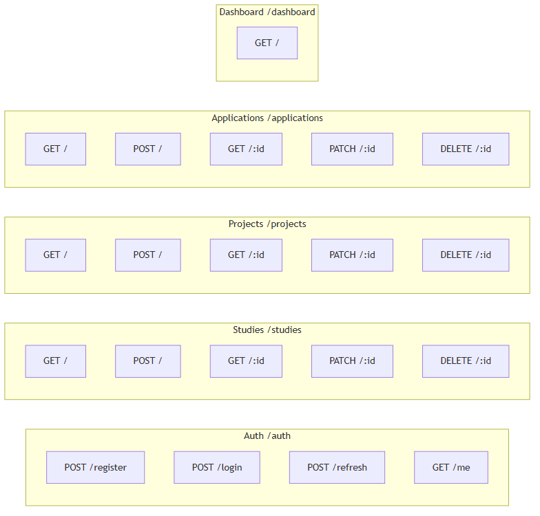

# API Specification

## Auth

- POST /auth/register
- POST /auth/login
- POST /auth/refresh

## Study

- GET /studies
- POST /studies
- PATCH /studies/:id
- DELETE /studies/:id

## Project

- GET /projects
- POST /projects
- PATCH /projects/:id
- DELETE /projects/:id

## Application

- GET /applications
- POST /applications
- PATCH /applications/:id
- DELETE /applications/:id
