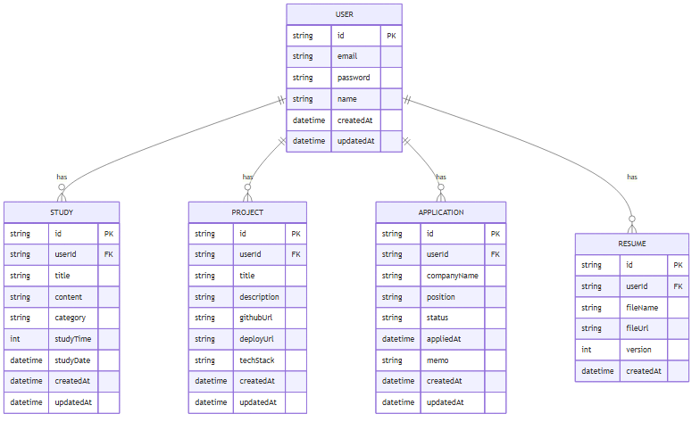

# ERD

## Users

사용자 정보

| Column     | Description       |
| ---------- | ----------------- |
| id         | 사용자 ID         |
| email      | 이메일            |
| password   | 암호화된 비밀번호 |
| name       | 사용자 이름       |
| created_at | 생성일            |
| updated_at | 수정일            |

---

## Studies

학습 기록

| Column     | Description   |
| ---------- | ------------- |
| id         | 학습 기록 ID  |
| user_id    | 사용자 ID     |
| title      | 학습 제목     |
| content    | 학습 내용     |
| category   | 학습 카테고리 |
| study_time | 학습 시간     |
| study_date | 학습 날짜     |
| created_at | 생성일        |
| updated_at | 수정일        |

---

## Projects

프로젝트 관리

| Column      | Description   |
| ----------- | ------------- |
| id          | 프로젝트 ID   |
| user_id     | 사용자 ID     |
| title       | 프로젝트명    |
| description | 프로젝트 설명 |
| github_url  | GitHub 주소   |
| deploy_url  | 배포 주소     |
| tech_stack  | 사용 기술     |
| created_at  | 생성일        |
| updated_at  | 수정일        |

---

## Applications

지원 현황

| Column       | Description |
| ------------ | ----------- |
| id           | 지원 ID     |
| user_id      | 사용자 ID   |
| company_name | 회사명      |
| position     | 지원 포지션 |
| status       | 진행 상태   |
| applied_at   | 지원일      |
| memo         | 메모        |
| created_at   | 생성일      |
| updated_at   | 수정일      |

### Status

- APPLIED
- DOCUMENT_PASS
- INTERVIEW
- FINAL_PASS
- REJECTED

---

## Resumes

이력서 관리

| Column     | Description |
| ---------- | ----------- |
| id         | 이력서 ID   |
| user_id    | 사용자 ID   |
| file_name  | 파일명      |
| file_url   | 파일 URL    |
| version    | 버전        |
| created_at | 생성일      |

---

## AI Analyses

AI 분석 결과

| Column     | Description |
| ---------- | ----------- |
| id         | 분석 ID     |
| user_id    | 사용자 ID   |
| content    | 분석 결과   |
| created_at | 생성일      |

---

## Relationships

User (1)

├── Studies (N)

├── Projects (N)

├── Applications (N)

├── Resumes (N)

└── AI Analyses (N)
